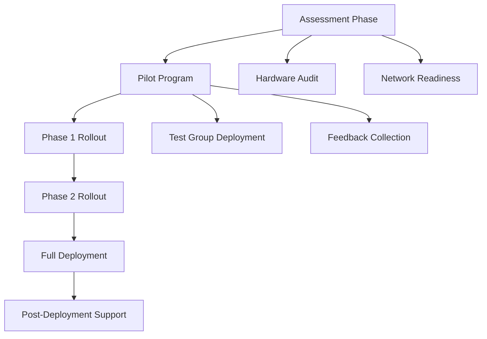

# K-12 Enterprise IT Modernization Strategy

## Overview
This project documents large-scale IT modernization initiatives across a multi-site K-12 district environment.

Environment:
- 8+ sites
- 500+ staff
- 16,000+ students

## Major Initiatives

### Windows 10 → Windows 11 Migration
- Phased deployment strategy
- Hardware compatibility validation
- Zero-downtime rollout approach

### POTS to VoIP Transition
- Legacy telephony replacement
- Vendor coordination
- Network readiness assessment (QoS, VLANs)

### Cloud Platform Integration
- Microsoft 365 + Google Workspace coexistence
- Identity synchronization strategy
- Licensing optimization

## Change Management Strategy
- Stakeholder communication plans
- Site-based rollout scheduling
- Staff training and documentation

## Risk Mitigation
- Rollback strategies for all major deployments
- Redundancy planning
- Pilot testing before full rollout

## Documentation
- SOPs for support teams
- End-user guides
- Technical runbooks

## Business Impact
- Minimal disruption across multiple campuses
- Increased system reliability
- Modernized learning and administrative platforms

